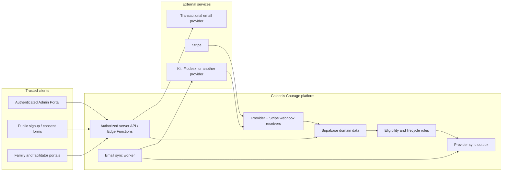
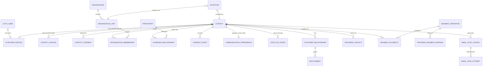
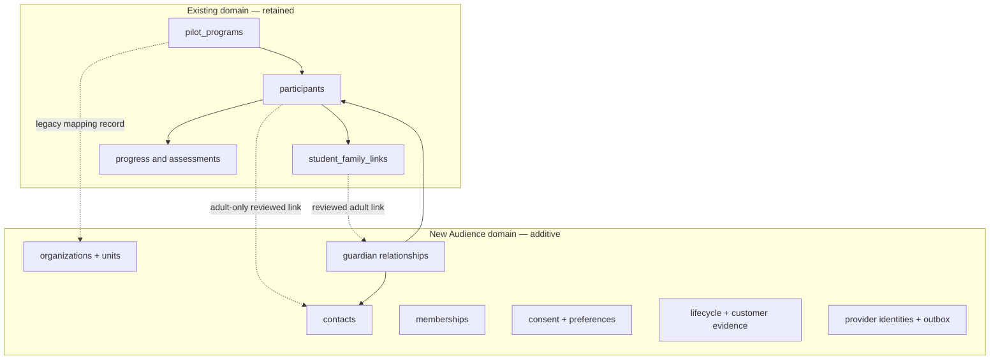
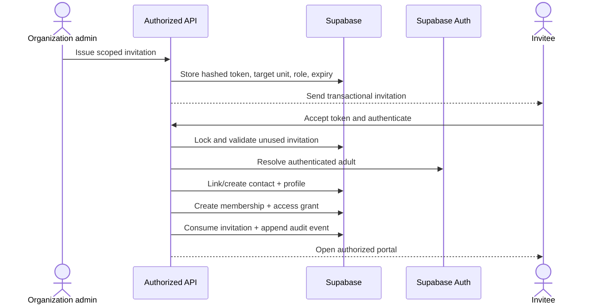
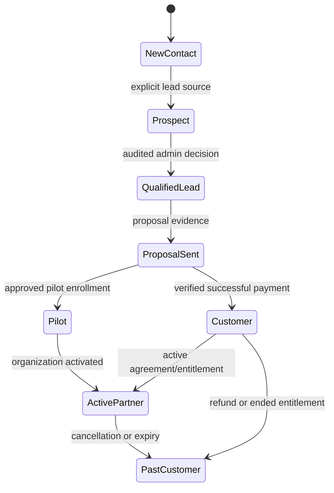
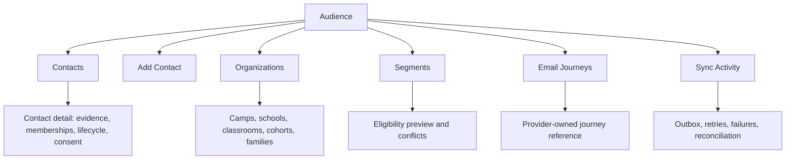
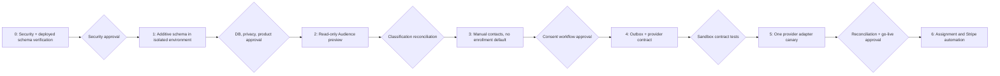

# Audience / CRM and Email Implementation Blueprint

**Status:** Design proposal only
**Date:** 2026-07-11
**Source audit:** [`docs/audits/audience-crm-email-audit.md`](../audits/audience-crm-email-audit.md)
**Implementation authorization:** None. This document contains no migration and no production code.

## 1. Purpose

This blueprint defines the architecture, data boundaries, proposed schema, workflows, security model, provider contract, rollout sequence, and decision gates for adding an Audience/CRM area to the Caiden's Courage Admin Portal.

It is deliberately implementation-free. Field lists are logical schema proposals, not executable SQL. Interface examples are contracts for design review, not application code.

## 2. Required outcomes

The future system must:

1. Represent adults independently from platform accounts, children, purchases, and organizations.
2. Assign authenticated users through explicit evidence rather than email-domain guesses.
3. Support marketing-only contacts without creating Supabase Auth users or platform access.
4. Keep child/student records outside marketing audiences.
5. Store lifecycle, customer, consent, suppression, and segment eligibility in Supabase.
6. Keep marketing content, visual design, timing, journeys, and unsubscribe mechanisms in the selected email provider.
7. Allow Kit, Flodesk, or another provider to be swapped without rebuilding Admin.
8. Make every provider operation durable, idempotent, observable, and reversible.
9. Preserve all existing program, participant, family-link, progress, and assessment data.
10. Ship first as a read-only classification preview.

## 3. Non-goals

This initiative will not:

- turn students into CRM contacts;
- infer consent from signup, platform use, a purchase, or a guardian relationship;
- infer organizations from email domains;
- make the external provider authoritative for identity, customer status, or access;
- hard-code marketing sequences in React or server functions;
- replace transactional email with marketing journeys;
- merge historical adults automatically by matching email alone;
- expose Audience data through the current client-side Admin passcode model;
- migrate existing records until a separately approved preview and reconciliation process is complete.

## 4. Architecture decisions

| ID | Decision | Consequence |
|---|---|---|
| AD-01 | `contacts` represents adults and marketing identities; `participants` remains the learning-participant domain. | Students never enter marketing provider sync. |
| AD-02 | A contact may exist without an Auth user. | Manual prospects and newsletter contacts do not receive platform access. |
| AD-03 | Organizations and memberships are explicit, many-to-many records. | One adult can safely hold different roles across multiple organizations. |
| AD-04 | Consent is append-only evidence with a current projection. | Withdrawals remain auditable and cannot be overwritten by later activity. |
| AD-05 | Lifecycle and customer status are separate. | A customer can also be a prospect for another product without receiving conflicting journeys. |
| AD-06 | Segment membership is computed eligibility, not hand-maintained provider state. | Supabase remains authoritative and provider drift can be reconciled. |
| AD-07 | Provider operations use a transactional outbox. | Browser/network failures do not silently lose sync intents. |
| AD-08 | Provider adapters run only server-side. | Kit/Flodesk credentials and semantics never reach the UI. |
| AD-09 | Admin authorization must be replaced before Audience routes ship. | The read-only UI is blocked until server-authenticated roles and restrictive RLS exist. |
| AD-10 | Existing records are linked, not rewritten, in the first migration. | Rollback is safe and legacy portal behavior remains intact. |

## 5. Target system context



### Ownership boundaries

| Concern | Authority |
|---|---|
| Adult identity and source evidence | Supabase |
| Auth account and admin authorization | Supabase Auth + server-side roles |
| Family, organization, unit, and role assignment | Supabase |
| Student identity and learning progress | Existing participant domain |
| Lifecycle and customer status | Supabase, derived from verified events |
| Marketing consent and suppression | Supabase, reconciled with provider events; most restrictive state wins |
| Segment eligibility | Supabase rules |
| Provider contact/segment IDs and sync status | Supabase integration records |
| Marketing content, journey timing, layout, and provider unsubscribe footer | External marketing provider |
| Transactional email content and delivery | Trusted server-side transactional service |
| Payment truth | Verified Stripe webhook event ledger |

## 6. Domain model



### Existing-to-target boundary



Dashed edges are future reviewed links. They do not imply automatic merging or mutation of legacy rows.

## 7. Proposed logical database schema

All names and types require database/security review. `citext` or a controlled normalized-email function may replace text normalization after compatibility review. Sensitive notes/evidence require retention and access rules.

### 7.1 Identity and contacts

#### `contacts`

| Field | Logical type | Required | Purpose |
|---|---|---:|---|
| `id` | UUID | Yes | Stable adult/contact identity |
| `primary_email` | text | No | Current display/delivery email |
| `normalized_email` | text | No | Matching key; not sufficient by itself to merge identities |
| `first_name`, `last_name` | text | No | Adult name |
| `contact_kind` | controlled text | Yes | marketing_contact, platform_user, customer, organization_member, internal_admin |
| `status` | controlled text | Yes | active, archived, pending_review |
| `created_at`, `updated_at` | timestamp | Yes | Audit fields |
| `created_by_type`, `created_by_id` | text + UUID | Yes | Source actor |

Constraints proposed for review:

- `contact_kind` cannot be `student` or `child`.
- Normalized email is indexed, but not globally unique until shared-email/product rules are approved.
- Archiving never deletes consent, lifecycle, customer, or provider history.

#### `platform_profiles`

| Field | Logical type | Required | Purpose |
|---|---|---:|---|
| `id` | UUID | Yes | Profile identity |
| `auth_user_id` | UUID FK to Auth | Yes | One-to-one authenticated user |
| `contact_id` | UUID FK | Yes | Adult contact represented by account |
| `display_name` | text | No | Platform display value |
| `account_status` | controlled text | Yes | invited, active, suspended, closed |
| `created_at`, `activated_at` | timestamp | Yes/No | Account history |

Creating a contact does not create this row or an Auth user.

#### `contact_sources`

Stores each source independently: manual admin, waitlist, Netlify form, parent claim, pilot signup, import, or verified checkout. Includes `source_record_type`, `source_record_id`, captured-at time, raw classification, and an idempotent source key. Raw PII payloads should not be copied wholesale.

#### `contact_identity_links`

Records reviewed associations between a contact and legacy adult-bearing rows without overwriting those rows. Fields include source table/key, confidence, match reason, review status, reviewed actor/time, and conflict notes.

### 7.2 Organizations, units, and access

#### `organizations`

Canonical legal/operating entity: name, organization type, status, billing reference, and timestamps. It does not represent a classroom, cohort, or family by itself.

#### `organization_units`

| Field | Purpose |
|---|---|
| `organization_id` | Parent organization |
| `parent_unit_id` | Optional hierarchy |
| `unit_type` | camp, school, classroom, cohort, family, program |
| `name` | Human-readable unit name |
| `status`, `starts_at`, `ends_at` | Operational period |
| `legacy_program_id`, `legacy_program_code` | Temporary mapping to `pilot_programs`; code is not the long-term FK |

#### `organization_memberships`

Joins a contact/profile to an organization/unit with a controlled role, ownership flag, membership status, dates, assignment source, evidence ID, and audit fields. A unique active-membership rule should prevent accidental duplicates while allowing historical memberships.

#### `invitations`

Stores a hash of a single-use token, intended email/contact, target unit, role, issuer, issued/expiry/consumed/revoked times, status, and metadata. Plain tokens are never stored. Acceptance creates an explicit membership and access grant in one server transaction.

#### `access_grants`

Separates portal authorization from organization membership. Contains subject profile, scope type/ID, permission set, grant source, validity dates, status, and revocation details.

### 7.3 Adult-to-child relationships

#### `guardian_relationships`

| Field | Purpose |
|---|---|
| `contact_id` | Adult contact |
| `participant_id` | Existing student participant |
| `relationship_type` | parent, guardian, caregiver, authorized_adult |
| `status` | pending, verified, ended |
| `verification_source` | claim token, facilitator invitation, manual reviewed link |
| `verified_at`, `verified_by` | Evidence |
| `legacy_student_family_link_id` | Traceability to current link |

This relationship grants no marketing permission. Authorization to view a child requires a separate access grant and verified relationship.

### 7.4 Consent and communication state

#### `consent_events` (append-only)

| Field | Purpose |
|---|---|
| `contact_id` | Adult identity |
| `channel` | email, SMS, push |
| `purpose` | marketing, product_updates, research, transactional_preference |
| `action` | granted, withdrawn, corrected, imported_unclear |
| `status_after` | confirmed, unclear, unsubscribed, suppressed, unknown |
| `source` | form, admin, provider_webhook, import, support_request |
| `notice_version` | Exact notice accepted |
| `occurred_at`, `recorded_at` | Event and storage time |
| `actor_type`, `actor_id` | Contact/admin/provider/system |
| `evidence` | Minimal structured evidence, access controlled |
| `idempotency_key` | Prevent repeated provider/webhook events |

#### `communication_preferences` (current projection)

One row per contact/channel/purpose. Contains current status, effective time, winning consent-event ID, suppression reason, and provider reconciliation state. The precedence rule is:

```text
suppressed > unsubscribed > unclear/unknown > confirmed
```

No signup, purchase, login, claim, or activity event can lower the restriction level.

### 7.5 Lifecycle, interests, and customer evidence

#### `lifecycle_events` (append-only)

Records `from_stage`, `to_stage`, reason, evidence type/ID, actor, and time. Proposed stages:

```text
new_contact | prospect | qualified_lead | proposal_sent |
pilot | customer | active_partner | past_customer | unknown
```

#### `contact_lifecycle_state`

Current projection pointing to the winning lifecycle event. This is query-friendly but rebuildable from history.

#### `contact_interests`

Many-to-many interest keys with source, confidence, expressed time, expiry, and status. Proposed keys: book, family_membership, camp_program, school_program, classroom_program, sel_platform, facilitator_resources.

#### `customer_relationships`

Connects a contact or organization to a verified customer relationship. Stores relationship type, status, source system, external customer ID, start/end dates, and evidence strength. It is not inferred from a Payment Link click.

#### `commerce_events` (append-only)

Verified Stripe webhook ledger containing provider event ID, event type, customer/checkout/subscription references, sanitized payload, event time, received time, processing status, and idempotency state.

#### `entitlements`

Represents what access was purchased or granted, for whom, scope, start/end, status, source commerce event/agreement, and revocation reason. Customer status is derived from verified relationships/events; access is derived from entitlements.

### 7.6 Segments and provider integration

#### `segment_definitions`

| Field | Purpose |
|---|---|
| `key`, `name`, `description` | Provider-neutral identity |
| `category` | audience, lifecycle, customer, eligibility, interest |
| `rule_version` | Reproducible evaluation |
| `rule_definition` | Validated rule DSL/JSON, not arbitrary SQL from Admin |
| `precedence_group`, `priority` | Prevent conflicting journeys |
| `active` | Evaluation toggle |

#### `segment_eligibility`

Materialized/projection result per contact and segment: eligible flag, evidence summary, confidence, evaluated rule version/time, exclusion reason, and consent-preference version. This is a preview/decision record, not proof that the provider applied the segment.

#### `provider_accounts`

Provider key, enabled/capabilities, account label, secret reference name, and operational status. No secret value is stored in ordinary application tables.

#### `provider_contacts`

One row per contact/provider: external contact ID, provider status, last sync, last observed unsubscribe/suppression, remote version/hash, and reconciliation status.

#### `provider_segment_mappings`

Maps internal segment keys to external segment IDs/names for a provider account. Provider IDs never appear in UI/domain constants.

#### `email_sync_outbox`

Durable intent: contact, provider, operation, internal segment key, payload version, idempotency key, eligibility/consent version, status, next attempt, attempt count, timestamps, and correlation ID.

#### `email_sync_attempts`

Append-only attempt result: outbox ID, attempt number, started/completed time, provider response classification, sanitized error, retryable flag, provider request/message ID, and latency.

#### `provider_webhook_events`

Append-only, idempotent receipt of unsubscribe, complaint, bounce, contact, and segment events. Stores signature verification outcome and processing status. Raw payload retention must be minimized.

### 7.7 Administration audit

#### `admin_audit_events`

Records actor profile, action, target type/ID, before/after summaries with sensitive values redacted, request correlation ID, reason, and time. Consent, lifecycle, membership, provider replay, and manual-contact actions require audit entries.

## 8. Classification model

Classification has four independent axes. One does not imply another.

| Axis | Examples | Authority |
|---|---|---|
| Audience type | parent, teacher, facilitator, camp leader, school leader, community partner, internal admin | Explicit relationship or reviewed membership |
| Lifecycle | new contact, prospect, pilot, customer, active partner, past customer | Append-only lifecycle events |
| Customer status | non-customer, one-time purchaser, active member/camp/school, lapsed | Verified commerce/agreement/entitlement evidence |
| Communication eligibility | transactional only, confirmed marketing, unclear, unsubscribed, suppressed | Consent events and current preference |

### Confidence policy

| Confidence | Required evidence | Automation allowed |
|---|---|---|
| High | Explicit role/relationship or verified external event tied to a resolved contact | Read-only classification; marketing only if consent independently confirmed |
| Medium | Program context plus adult contact field; reviewed legacy association | Preview and manual review only |
| Low | Free text, name/email similarity, or application-assigned status without source evidence | No automatic action |
| Unknown | Missing or conflicting evidence | Safe default; no marketing sync |

## 9. Key workflows

### 9.1 Add a marketing-only contact

```mermaid
sequenceDiagram
  actor Admin
  participant UI as Audience UI
  participant API as Authorized API
  participant DB as Supabase
  participant Rules as Eligibility evaluator
  participant Outbox as Sync outbox

  Admin->>UI: Enter adult contact and source
  UI->>API: Submit with do-not-enroll=true by default
  API->>API: Authorize and validate
  API->>DB: Search normalized identity candidates
  alt possible duplicate
    API-->>UI: Return candidates for review; create nothing
  else new contact
    API->>DB: Create contact + source + audit event
    opt explicit consent evidence supplied
      API->>DB: Append consent event
    end
    API->>Rules: Evaluate eligibility
    alt eligible and enrollment explicitly approved
      Rules->>Outbox: Queue provider-neutral intent
    else hold
      Rules-->>DB: Record exclusion / do-not-enroll
    end
    API-->>UI: Return contact and sync state
  end
```

The workflow never creates Auth, a participant, family/program, organization membership, entitlement, or purchase.

### 9.2 Create a platform user through invitation



All database changes occur in one server-controlled transaction after token and actor validation. Marketing enrollment is not part of invitation acceptance.

### 9.3 Guardian/student association

Existing `student_family_links` remains operational. A future reviewed link creates a `guardian_relationship` referencing the existing participant. Verification may use an expiring claim token, facilitator-issued invitation, or authorized manual review. It never copies a child email into `contacts` and never creates marketing consent.

### 9.4 Segment evaluation and provider sync

```mermaid
sequenceDiagram
  participant Event as Domain event
  participant DB as Supabase
  participant Rules as Eligibility engine
  participant Outbox as Outbox
  participant Worker as Sync worker
  participant Adapter as Provider adapter
  participant Provider

  Event->>DB: Append verified fact
  DB->>Rules: Re-evaluate affected contact
  Rules->>DB: Store eligibility + evidence/version
  Rules->>Outbox: Insert idempotent add/remove/suppress intent
  Worker->>Outbox: Claim pending intent
  Worker->>DB: Recheck latest consent and eligibility
  alt still permitted
    Worker->>Adapter: Provider-neutral operation
    Adapter->>Provider: Provider-specific API request
    Provider-->>Adapter: Result
    Adapter-->>Worker: Normalized result
    Worker->>DB: Record attempt and provider state
  else restricted or stale
    Worker->>DB: Cancel stale intent; queue suppression/removal if needed
  end
```

### 9.5 Provider unsubscribe

1. Verify webhook signature and provider account.
2. Deduplicate by provider event ID.
3. Resolve provider contact to local contact.
4. Append `consent_event(action=withdrawn)` or suppression event.
5. Update current preference using restrictive precedence.
6. Re-evaluate every marketing segment.
7. Queue removals/suppression as required.
8. Never reactivate based on later signup, claim, purchase, login, or progress events.

### 9.6 Stripe conversion



A signed and idempotently processed Stripe webhook creates commerce evidence. It may update customer/lifecycle projections and entitlements, but not marketing consent. Conversion removes prospect-nurture eligibility before adding customer eligibility according to journey precedence.

## 10. Provider-neutral contract

The eventual implementation should support these semantic operations:

| Operation | Required behavior |
|---|---|
| Upsert contact | Create/update only when local state permits; never force reactivation |
| Update fields | Send an allowlisted adult-only field set |
| Add to segment | Idempotently add using mapped external segment ID |
| Remove from segment | Idempotently remove; missing membership is success |
| Get status | Normalize subscribed, unsubscribed, bounced, complained, suppressed, unknown |
| Suppress contact | Apply the strongest supported provider suppression |
| Reconcile contact | Compare remote/local state without weakening local restrictions |

### Adapter capability matrix

Before selecting a provider, verify current vendor capabilities rather than assuming parity.

| Capability | Kit adapter | Flodesk adapter | Required fallback |
|---|---|---|---|
| Contact upsert | Must be verified during implementation | Must be verified | Manual import is not acceptable for automatic sync |
| Segment add/remove | Must be verified | Must be verified | Capability flag and explicit operational hold |
| Unsubscribe/suppression read | Must be verified | Must be verified | Provider webhook/export reconciliation |
| Unsubscribe webhook | Must be verified | Must be verified | Scheduled reconciliation if legally/operationally acceptable |
| Idempotency support | Record provider behavior | Record provider behavior | Local unique intent key always required |
| Custom fields | Map allowlisted fields | Map allowlisted fields | Store locally; do not expose unsupported fields |
| Workflow enrollment semantics | External configuration | External configuration | Segment-based provider journey |

Provider limitations are represented as adapter capabilities. They must not leak into Audience route names, database taxonomy, or lifecycle rules.

## 11. Security and privacy design

### 11.1 Admin authentication

Audience routes require:

- Supabase Auth or another server-verifiable identity;
- MFA for privileged administrators;
- server-stored admin roles and scoped organization permissions;
- short-lived sessions and server authorization on every request;
- no authorization based on `REACT_APP_*`, local storage, or UI visibility.

### 11.2 RLS posture

Default deny all new Audience tables. Proposed access classes:

| Actor | Access |
|---|---|
| Anonymous | Public consent/signup RPC only; no direct table reads |
| Authenticated contact | Own profile/preferences where product-approved; no provider/log/admin data |
| Organization admin | Scoped membership/contact summaries only where explicitly permitted |
| Internal audience admin | Adult contacts and lifecycle within assigned scope |
| Compliance admin | Consent/suppression evidence and exports |
| Service worker | Outbox/provider records only through service identity |

RLS tests must demonstrate denied reads/writes, not only successful paths.

### 11.3 Server endpoints

- Derive recipients, templates, segment mappings, and relationship IDs from trusted database state.
- Do not accept arbitrary email HTML or provider tags from browsers.
- Require authorization, CSRF/origin controls where applicable, validation, rate limits, and correlation IDs.
- Verify Stripe/provider webhook signatures over the raw request body.
- Keep service-role and provider secrets in server secret storage.

### 11.4 Data minimization

- Never sync student names, emails, progress, grades, assessment results, or access codes to marketing providers.
- Prefer contact ID/hash rather than email in operational logs.
- Define retention for provider payloads, errors, consent evidence, notes, and audit events.
- Encrypt or restrict sensitive notes/evidence; avoid free-form child data.
- Mask contact details in Admin lists and exports by role.

## 12. Admin Portal information architecture



### Screen behavior

| Screen | First-release behavior |
|---|---|
| Contacts | Read-only adult list; source/confidence/eligibility; no children |
| Add Contact | Later phase; do-not-enroll defaults on; duplicate review before create |
| Organizations | Read-only canonical org/unit and membership relationships |
| Segments | Rule/evidence preview, eligible/excluded/ambiguous counts, overlap warnings |
| Email Journeys | Provider-neutral name, mapped provider, external status/link; no sequence editor |
| Sync Activity | Masked identity, intent, attempt state, retry eligibility, sanitized error |

## 13. Read-only classification preview

The first product increment calculates candidate contacts without writing links or provider data.

### Candidate sources

- adult `participants.email` with explicit adult role;
- `student_family_links.parent_email` as guardian candidates;
- `pilot_programs.admin_email` as program-administrator candidates;
- `pilot_waitlist.parent_email` as prospect candidates;
- separately exported Netlify Form records only after source/consent review.

### Preview output

For each pseudonymous candidate:

- source row types and counts;
- proposed audience/lifecycle/customer/eligibility classifications;
- exact evidence fields;
- confidence and ambiguity;
- possible duplicate groups without auto-merge;
- child-exclusion result;
- consent result and winning restriction;
- proposed action: hold, manual review, eligible for later link, or exclude.

### Preview invariants

- No `contacts` inserts.
- No legacy updates.
- No Auth operations.
- No provider calls.
- No full-email exports in ordinary logs/reports.
- Unknown and conflicting records default to hold.

## 14. Idempotency, retries, and reconciliation

### Idempotency key

Logical form:

```text
provider-account : contact-id : operation : target-key : eligibility-version
```

The exact canonical encoding and hash require implementation review. A unique database constraint is required regardless of provider support.

### Retry policy

| Result | Action |
|---|---|
| Network timeout / provider 429 / transient 5xx | Exponential backoff with jitter |
| Invalid field / unmapped segment / permission 4xx | Dead-letter and alert; no blind retry |
| Local consent became restrictive | Cancel stale add/upsert; queue removal/suppression |
| Provider says already present/absent | Treat as idempotent success |
| Unknown provider state after timeout | Query status or reconcile before repeating if provider semantics require it |

### Reconciliation

Run a scheduled aggregate reconciliation per provider account:

1. compare local eligible contacts and segment mappings with remote state;
2. prioritize local unsubscribed/suppressed states;
3. import restrictive remote states as consent/suppression events;
4. report drift without automatically weakening restrictions;
5. create repair intents only through the same outbox.

## 15. Rollout plan and gates



### Phase acceptance criteria

| Phase | Must be true before continuing |
|---|---|
| 0 | Deployed schema/RLS inventoried; current Admin threat addressed; backups and restore tested; consent policy approved |
| 1 | New tables are additive and default-deny; migration rehearsal/rollback reviewed; no legacy row mutation |
| 2 | Preview excludes children, exposes evidence/confidence, and reconciles aggregate counts without writes |
| 3 | Contact creation cannot create Auth/access/student/customer state; do-not-enroll default verified |
| 4 | Adapter contract, idempotency, retry, webhook, suppression, redaction, and kill-switch tests pass |
| 5 | Allowlisted sandbox/canary contacts only; local/provider counts reconcile; no suppressed contact reactivated |
| 6 | Signed invitation replay/conflict tests and Stripe signature/refund/idempotency tests pass |

## 16. Testing blueprint

### Unit and rule tests

- email normalization without auto-merging;
- adult/child exclusion;
- audience classification evidence and confidence;
- consent precedence and irreversible suppression behavior;
- lifecycle transition legality and history;
- segment overlap and journey precedence;
- outbox idempotency-key stability.

### Database and RLS tests

- anonymous denial on every Audience table;
- cross-organization denial;
- organization-admin scope boundaries;
- append-only consent/lifecycle/provider events;
- unique source event, webhook event, and outbox keys;
- transaction rollback for invitation and domain-event/outbox writes.

### Contract tests

Every provider adapter must pass the same suite for upsert, update, add, remove, status, suppress, transient errors, permanent errors, unknown outcomes, and redaction.

### Integration tests

- manual contact with do-not-enroll;
- explicit consent then enrollment;
- withdrawal during queued sync;
- provider unsubscribe webhook replay;
- prospect-to-customer conversion without conflicting journeys;
- Stripe duplicate, refund, and out-of-order events;
- invitation expiry, replay, wrong-email, conflicting membership, and revocation.

### End-to-end tests

Use isolated environments and allowlisted adult test recipients. No real children, production contacts, live provider segments, or live email journeys until explicit approval.

## 17. Observability and operations

Required operational views and alerts:

- outbox queue age and pending count;
- attempts by provider/result class;
- dead-letter count and oldest failure;
- verified/unverified webhook events;
- local/provider suppression drift;
- segment reconciliation differences;
- invalid mappings/capability failures;
- Audit Admin actions and manual retries;
- all metrics aggregate or pseudonymous by default.

The provider kill switch prevents new external calls while preserving queued intents. A per-contact hold prevents sync during identity or consent review.

## 18. Rollback design

- Add tables and links; do not rename/drop legacy structures in initial phases.
- Gate Audience routes, writes, worker, webhook processing, and each provider account separately.
- Disable provider workers without deleting outbox rows.
- Rebuild current lifecycle, consent, and eligibility projections from append-only events.
- Reverse newly created memberships/links with audited status changes, not destructive deletion.
- Keep local suppression authoritative throughout rollback.
- Never use rollback to re-enroll a contact or restore a less restrictive consent state.

## 19. Decisions required before schema finalization

| Decision owner | Required decision |
|---|---|
| Product | Canonical organization/unit/role/lifecycle/customer/interest taxonomies |
| Product + Support | Shared-email and multi-email identity policy; manual merge standards |
| Legal/Privacy | Consent language, purposes, notice versions, double opt-in, retention, age/adult model, jurisdictions |
| Security | Admin Auth/MFA, role hierarchy, service identities, RLS policy, notes/evidence protection |
| Finance | Authoritative customer, refund, subscription, agreement, and lapse rules |
| Marketing | Journey precedence, provider choice, Kit bridge duration, external segment ownership |
| Engineering | Edge Function vs Netlify worker placement, queue scheduling/locking, rule DSL, webhook storage |
| Data owner | Legacy source precedence and manual-review workflow |

## 20. Definition of ready for the first migration

No migration should be written until all of the following are complete:

- [ ] Product approves the domain vocabulary and screen responsibilities.
- [ ] Legal/privacy approves consent, suppression, retention, and child-exclusion requirements.
- [ ] Security approves the replacement Admin authentication and RLS model.
- [ ] Engineering confirms the deployed schema against repository SQL.
- [ ] Backups and a restore rehearsal are documented.
- [ ] Existing aggregate quality queries are reviewed and authorized.
- [ ] Contact identity/shared-email rules are approved.
- [ ] Stripe and email-provider capabilities are verified from current vendor documentation.
- [ ] Migration rollback and feature-flag strategy are approved.
- [ ] Read-only preview acceptance criteria and reconciliation tolerances are defined.
- [ ] Named owners approve the migration, application, provider, and rollback checkpoints.

## 21. Recommended next deliverables

These remain documentation/test-design tasks and should be completed in order:

1. Security design for Admin authentication, roles, and RLS.
2. Data dictionary with approved enums, nullability, ownership, and retention.
3. Deployed-schema comparison and aggregate-only data-quality query pack.
4. Consent and communications policy specification.
5. Read-only classification rule specification with fixtures.
6. Provider capability assessment for Kit and Flodesk using current official documentation.
7. Migration design package with forward/rollback scripts for review—but still not execution.

Only after these gates should production migrations or application code be authored.
