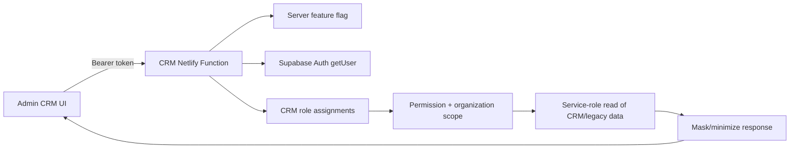

# Audience / CRM Phase 1 Runtime Architecture

Phase 1 is a read-only, feature-disabled-by-default path. Existing Admin screens continue using the legacy browser passcode. CRM screens additionally require a Supabase Auth session and fetch only protected Netlify Functions.

## Tables

`crm_admin_roles`, `crm_admin_role_assignments`, `contacts`, `crm_platform_profiles`, `contact_sources`, `contact_identity_links`, `organizations`, `organization_units`, `organization_memberships`, `invitations`, `access_grants`, `guardian_relationships`, and `admin_audit_events`.

No table is populated from legacy data. Role definitions are the only migration seed. No child contact kind exists.

## Endpoints

- `GET /.netlify/functions/crm-overview`
- `GET /.netlify/functions/crm-contacts`
- `GET /.netlify/functions/crm-contact?id=...`
- `GET /.netlify/functions/crm-organizations`
- `GET /.netlify/functions/crm-organization?id=...`
- `GET /.netlify/functions/crm-classification-preview`
- `POST /.netlify/functions/crm-bootstrap-admin` (one-time, disabled by default)

## Classification sources

Verified repository sources are non-student `participants`, parent fields in `student_family_links`, administrator fields in `pilot_programs`, and adult fields in `pilot_waitlist`. The preview returns masked adult email, pseudonymous ID, evidence, confidence, ambiguity, duplicate suggestion, and recommended action. It performs no writes or provider calls.

## Known ambiguity

Repository SQL does not prove deployed-table availability. Legacy mappings in the new schema intentionally omit FKs pending deployed-schema verification. Classification fails closed if a required legacy source is unavailable.
