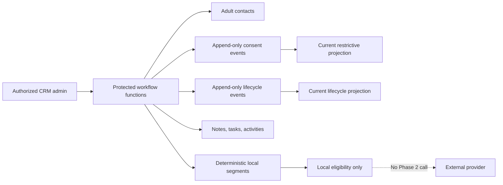

# Audience / CRM Phase 2 Runtime

Phase 2 adds local-only business workflows behind server flags. The browser sends a Supabase bearer token to protected Netlify Functions; server authorization, validation, default-deny RLS, audit events, and correlation IDs remain mandatory.

## Rules

Restriction order is `suppressed > unsubscribed > unclear/unknown > confirmed`. Later signup, purchase, membership, or activity cannot weaken a restrictive state. Lifecycle and customer evidence are separate. Provider-neutral eligibility never means provider enrollment.

## Routes

Add Contact, Segments, Tasks, and Activity are display-flagged and server-write-flagged. Notes, consent, lifecycle, and interests use protected server endpoints and can be surfaced within contact detail workflows without direct table access.
