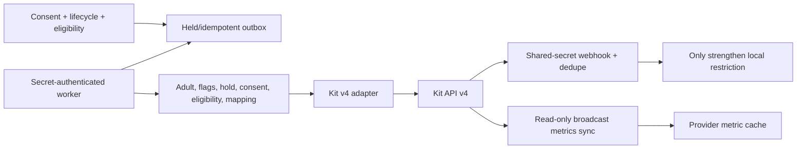

# Audience / CRM Phase 3 Runtime

Provider intents default held. The worker claims one row atomically with `FOR UPDATE SKIP LOCKED`, rechecks current local authority, and cancels stale/unsafe work. Only 429/5xx-class errors retry with exponential backoff and jitter. Provider/API secrets remain server-only.

The UI adds Email Journeys, Kit Subscribers, Email Performance, Subscriber Reconciliation, Sync Activity, and Provider Settings. It provides no broadcast sender or sequence editor.
