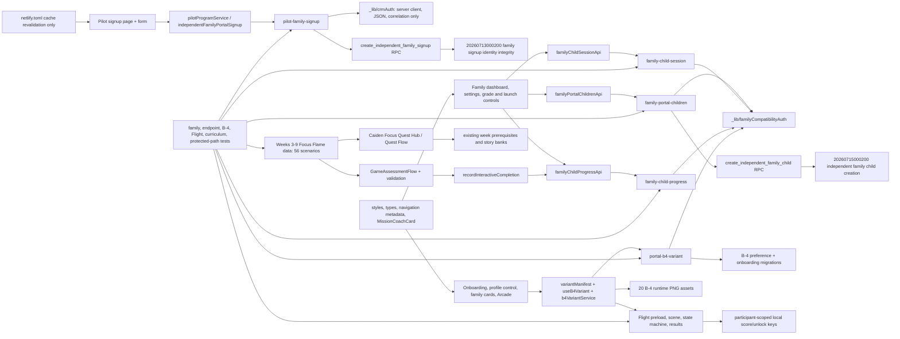

# Narrow production release validation — 2026-07-16

## Decision

**READY to create the final release branch for review.** No branch, commit, push, deploy, SQL execution, hosted-data mutation, email, campaign, webhook, or Kit/provider write occurred during this validation.

Candidate:

- production base: `3d4e65a4cae1d3d93fa7b1873214279ccf677a82`
- detached validation worktree: `/private/tmp/caidens-courage-narrow-release`
- approved changed/added files: 140
- excluded changed/untracked source files: 335
- broad production RLS migration: excluded
- production RLS restoration SQL: excluded
- top-level Netlify Functions added: exactly 5

The exact file lists are authoritative:

- `docs/deployment/narrow-release-approved-files-2026-07-16.txt`
- `docs/deployment/narrow-release-excluded-files-2026-07-16.txt`

## Complete release dependency graph

The graph below shows the changed runtime dependency closure. The 140-file manifest enumerates every changed node; unchanged imports continue to come from the published production base.

### Protected-data routing

| User workflow | Browser entry | Server-mediated operation | Authorization | Broad RLS required? |
|---|---|---|---|---|
| Independent family signup | `pilotProgramService` | `pilot-family-signup` → service-role RPC | validated request + server-generated codes + idempotency key | No |
| List/add family children | `familyPortalChildrenApi` | `family-portal-children` → service role; create uses RPC | validated legacy family program/access-code session | No |
| Launch child/update grade/save baseline | `familyChildSessionApi` | `family-child-session` | validated family compatibility session + exact participant membership | No |
| Read/write participant progress | `familyChildProgressApi` | `family-child-progress` | validated family compatibility session + exact participant membership | No |
| Read/save B-4 choice | `b4VariantService` | `portal-b4-variant` | validated family compatibility session + exact participant membership | No |
| Flight score/unlock | participant-specific browser storage key | no protected table operation | canonical participant ID namespaces every key | No |

The changed protected-data-path test confirms that family code does not fall back to anonymous browser reads when a server call fails. The B-4 endpoint was deliberately isolated from the newer portal-ownership/CRM-role tables because those tables are not part of the captured production inventory.

## Why the earlier isolated candidate failed

1. `FamilyMissionCoachPanel` was included without the matching `MissionCoachCard` prop implementation.
2. `pilotTrackingService` was copied with an unrelated learning-achievement import while its implementation dependency was omitted.
3. An unrelated CRM test was included without its Kit fixture.
4. The protected-path test still asserted the explicitly excluded Admin Question Bank route.
5. The production-baseline test was copied without its inventory/baseline fixtures.
6. Portal ownership helpers were initially included even though their CRM ownership tables are absent from the captured production schema.

Corrections in this candidate:

- included the required `MissionCoachCard` implementation and styling;
- removed learning-achievement, dashboard-goal onboarding, CRM/Kit, Question Bank, and production-inventory test hunks;
- reduced B-4 authorization to the approved family compatibility session and participant-membership check;
- retained the protected-path assertions for only the changed narrow-release workflows;
- removed staging-only wording/diagnostics from the production signup function;
- made the first B-4 constraint transitional for legacy `spark`, then normalized `spark` to `courage` before the final five-value constraint.

## Required Netlify Functions

Exactly these five top-level functions are new in the candidate:

1. `pilot-family-signup`
2. `family-portal-children`
3. `family-child-session`
4. `family-child-progress`
5. `portal-b4-variant`

Shared function dependencies:

- `_lib/crmAuth.js` — only server Supabase client construction, correlation IDs, and JSON response helpers are consumed by this release.
- `_lib/familyCompatibilityAuth.js` — validates the existing independent-family program/access-code compatibility session and participant membership.

No Kit function, email function, campaign function, webhook function, synchronization function, CRM workflow function, or `portal-ownership-session` function is part of the changed function manifest.

## Minimal additive migration list

Zero SQL is not possible for the requested signup, server-authoritative child creation, and persistent B-4 choice. Four additive migrations are required, in this order; none was executed:

1. `supabase/migrations/20260713000200_family_signup_identity_integrity.sql`
   - adds signup idempotency metadata/indexes;
   - creates the service-role-only atomic family + first-child signup RPC.
2. `supabase/migrations/20260715000100_b4_variant_preference.sql`
   - adds `participants.b4_variant_key` with default `courage`;
   - installs a transitional allowlist that accepts legacy `spark` until step 4.
3. `supabase/migrations/20260715000200_independent_family_child_creation.sql`
   - adds child-create idempotency metadata/index;
   - creates the service-role-only atomic child creation RPC;
   - writes an audit row only if the optional audit table exists.
4. `supabase/migrations/20260715000400_b4_selection_onboarding.sql`
   - adds `b4_variant_selected_at`;
   - normalizes only exact `spark` rows to `courage`;
   - installs the final five-variant constraint and bounded verification checks.

These migrations contain no RLS policy creation, RLS policy removal, table-grant broadening, staging seed, CRM foundation/workflow automation, Kit automation, or production-history repair. The proposed `20260714000450_production_portal_ownership_rls.sql` and its restoration SQL are explicitly excluded.

## Validation results

| Gate | Result | Evidence |
|---|---|---|
| Type-check | PASS | candidate `npm run typecheck` |
| Lint | PASS | 0 errors; 4 pre-existing warnings |
| Targeted family/signup tests | PASS | endpoint, client, form, and page tests; 16/16 in final focused rerun |
| Targeted protected-path/B-4 endpoint tests | PASS | 3 suites, 12/12 |
| Targeted B-4/Flight/migration-order tests | PASS | 1 suite, 12/12 |
| Full suite | PASS | final candidate: 61 suites, 301 tests |
| Production build | PASS | optimized build completed successfully |
| Changed protected-data paths | PASS | 4/4, no anonymous fallback |
| Secret scan | PASS | no JWT, Supabase secret-key pattern, or credential file detected in candidate source/build |
| Staging-reference scan | PASS | exact configured staging project reference occurred 0 times in candidate source/functions/build |
| Personal-path scan | PASS | no Desktop, Downloads, Finder, or personal absolute runtime path |
| B-4 assets | PASS | 20 files, 20 byte-distinct hashes, all transparent-canvas dimensions 1200×680 |
| Excluded SQL scan | PASS | no broad/staging/CRM RLS migration changed in candidate |
| Kit/provider safety | PASS | no candidate flag/config change enables Kit/provider writes; prior production gate flags remain false |
| `git diff --check` | PASS | no whitespace errors |

The outdated Browserslist database and bundle-size messages are non-blocking tool warnings, not lint/build failures.

## Deployment sequence (future approval required)

1. Confirm the production backup checkpoint and record the database restore identifier.
2. Reconfirm production environment identity and all provider/write/email flags are false.
3. Apply the four reviewed additive migrations in the exact order above; stop on any precheck or verification failure.
4. Verify both family RPCs, the B-4 columns, the final five-value constraint, and PostgREST schema reload.
5. Build the isolated release branch from base `3d4e65a4cae1d3d93fa7b1873214279ccf677a82` using only the approved manifest.
6. Deploy to a Netlify deploy preview and run the smoke checklist.
7. Request explicit production-deploy approval.
8. Deploy the same immutable candidate to the linked production site.
9. Run production smoke tests without Kit/provider writes or email sends.

## Rollback sequence

1. Stop if signup, child linkage, grade save, baseline completion, B-4 persistence, or Week 3-9 progression fails.
2. Republish Netlify deploy `6a5087522fb9ab000858a34b` (commit `788fecaa1be5b6a0d4cbcc79892fe1fa7992b561`) without rebuilding.
3. Verify the prior homepage, Admin login, family compatibility login, and existing child sessions.
4. Leave additive columns/indexes/RPCs in place during an application rollback unless the database owner authorizes a separately reviewed database restoration. Do not reverse the exact `spark → courage` normalization automatically.
5. Use the recorded database backup only if a verified database-impact incident requires it and an explicit restore is approved.

Netlify target for the future approved release: site `quiet-pothos-3ae8ce`, masked site ID `7a45***df3a`, production domain `caidenscourage.com`, branch `main`. Current published deploy at validation time: `6a5256cf1c7b49000807a71a`, commit `3d4e65a4cae1d3d93fa7b1873214279ccf677a82`.

## Production smoke checklist

- Homepage and static assets load with no stale bundle/service-worker behavior.
- One controlled independent-family signup sends exactly one POST and reaches a family dashboard.
- Retry/double-click reuses the idempotent family result and creates no duplicate program or participant.
- Existing compatibility-session family can sign in and refresh.
- Existing child list loads; a controlled new child links to the correct family only.
- Child grade saves and remains after refresh/session relaunch.
- Child session starts, baseline answers save, completion persists, and Week 1 unlocks.
- No other family can read or update that participant.
- All five B-4 variants display; first-time selector appears once; saved choice survives refresh and another session.
- Legacy `spark` displays as Courage; invalid B-4 value is rejected.
- Profile, family dashboard, Arcade, and Flight display the same participant choice.
- Flight transitions idle/happy/hurt/blinking without changing variant; scores remain participant-isolated.
- Weeks 3-9 supplemental missions appear under existing prerequisites; each contains eight scenarios; existing story questions remain unchanged.
- Progress and completion survive refresh; no existing result is reset.
- Admin/public regression smoke passes.
- Network/log review confirms no Kit/provider write, email, campaign, broadcast, webhook, subscriber synchronization, or child-data egress.

## Explicit exclusions and remaining cautions

- The broad 16-table production ownership RLS migration and restoration SQL are not in the candidate.
- Existing production table access policies are unchanged by this candidate.
- `ENABLE_INITIAL_GOAL_SELECTION` and related dashboard onboarding are excluded.
- Admin Question Bank work is excluded.
- CRM, Kit automation, staging-only SQL, generated reports, local caches, worktrees, screenshots, and personal assets are excluded.
- The final branch has not been created. It should be created only from the verified production base and populated from the approved manifest after review.
- The four minimal migrations still require the normal production backup, dry-run/precheck, and explicit execution approval; this task did not execute them.
