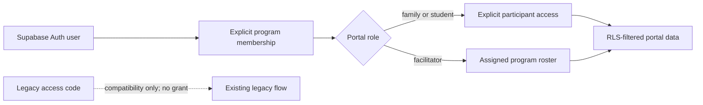

# Portal Auth ownership transition

Status: implemented and verified in staging; production not changed.

## Boundary

Supabase Auth identifies the user. Authorization is granted only by explicit rows in `portal_program_memberships` and, for family/student access, `portal_participant_access`. Email addresses, last names, client-selected participant IDs, and access codes never create ownership.

## Flags

- `PORTAL_AUTH_OWNERSHIP_ENABLED` and `REACT_APP_PORTAL_AUTH_OWNERSHIP_ENABLED` enable the additive Auth session boundary.
- `PORTAL_ACCESS_CODE_COMPATIBILITY_ENABLED` and its client equivalent keep legacy access-code flows available during transition.
- Disabling compatibility is a later product cutover and requires proof that every active family, student, and facilitator has an explicit Auth grant.

## Server contract

`GET /.netlify/functions/portal-ownership-session` validates the bearer token server-side, loads only active/non-expired grants for the exact Auth user ID, and returns program/participant scopes. It does not infer relationships and does not write.

`grant_portal_ownership` is service-role-only. Family and student grants require an explicit participant connected to the selected program. Every grant creates an audit event. Facilitator access is program-scoped.

## Staging verification

The disposable authorization matrix proved:

- anonymous users receive no sensitive rows;
- one guardian can read only the explicitly linked fictional child;
- one student can read only the explicitly linked self record;
- a facilitator can read the assigned fictional program roster;
- direct family writes are denied;
- internal-admin and service-role controls retain their expected scopes;
- no email inference or access-code ownership grant occurs;
- all disposable Auth users and their cascading ownership rows are removed.

Evidence: `docs/audits/staging-portal-ownership-result.json`.

## Production cutover rule

Do not disable legacy compatibility or apply ownership policies to production until the production manifest preflight is green, real accounts have reviewed explicit mappings, server-mediated writes replace anonymous browser writes, rollback is rehearsed, and explicit approval is recorded.
